# BLOOD BANK MINI PROJECT USING JDBC AND MYSQL

 -> This is a blood_bank CLI based mini project done using jdbc and mysql.
 
 

 

# DESCRIPTION

-> This is a command line application built using java and MySql API. 
-> This program automatically creates a database named "bloodbank" in the local host having a default port number 3306 and uses that databases.  

Before running the application: 
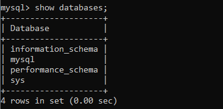

After running the application: 
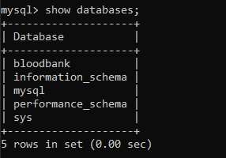

-> The program also creates 3 tables in that database named Admin, Donor and Seeker.  

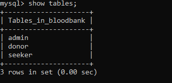

-> It has two login featurs : Admin Login and User Login.  
-> The default admin username is "admin" and password is "admin" case sensitive.  

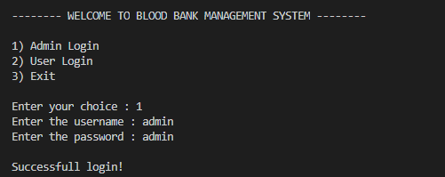

# FEATURES OF USING THIS PROGRAM

# ADMIN FEATURES
 
-> The admin must first login using default username and password (username and password are case senstitive).  
-> Then it will show a list of actions that an admin can do.  

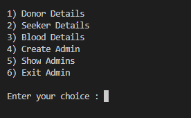

-> The admin can view and delete donor details   

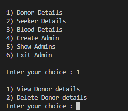

-> Similarly admin can view and delete seeker details.  

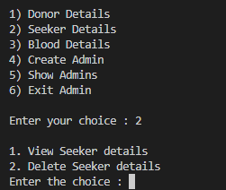

-> Blood Details option enables admin to see  
    1) Donor - Seeker matching based on their blood group  
    2) Donor full details 
    3) Seeker full details 
    
 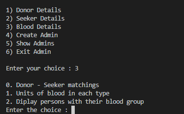
 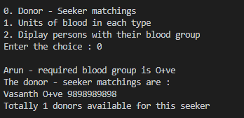
 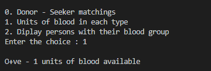
 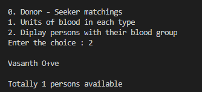
 
 -> Admin can create new login.
 
 -> Admin can see all the list of usernames and password who can login to the application.  

# DONOR FEATURES

-> The donors can create their entry for donating the blood.  

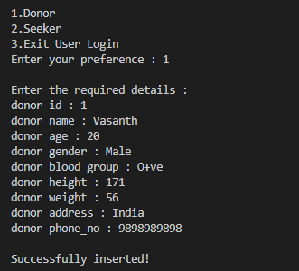

-> The seeker can also create their entry requesting for blood.  

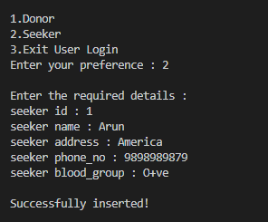

# HOW TO RUN THIS APPLICATION?

-> Install MySql and Java 
-> Install mysql-connector-java.jar file to connect Java with MySql 
-> Create java project  
-> Add mysql-connector-java.jar as referenced library to the java project  
-> Copy this code to the main file  
-> Run java code  
-> Hurray! Code got run.
